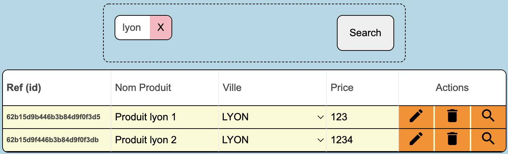
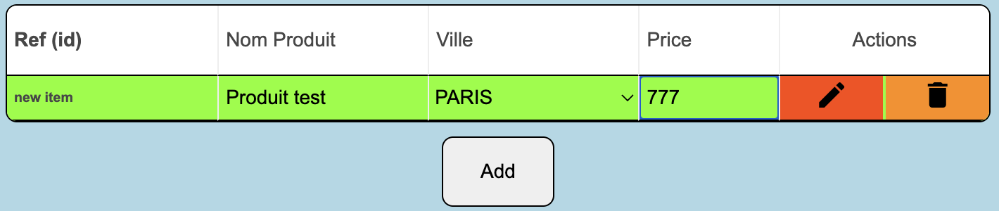

# PALO-IT : test technique Fullstack

Test réalisé par [Valentin S](https://github.com/vasalome) entièrement en local sur docker avec la Stack Mern.
- Client: ReactJs (Typescript)
- Server: NodeJs & ExpressJs
- BDD: Mongo

## Prérequis :
> - Installer Docker
> - Les ports suivants doivent être libres :
>   - :3000
>   - :8000
>   - :27017
## Usage

Une fois le projet cloner, lancer docker puis la commande dans ce dossier:

```docker-compose up```

*Attendre le chargement complet des images docker.*

Le projet est alors accessible par l'url ```http://localhost:3000/```
___

### Exercice 1: Jouer avec des Tags

<br/>
<br/>
<br/>
<br/>

### Exercice 2: A nous les données et les WS REST

Le travail est accessible dans le dossier ```/serveur``` et les CRUD ont été réalisé directement dans le fichier ```/serveur/server.js```

### Exercice 3: Cherchons les produits

<br/>
<br/>

### Exercice 4: A nous le CRUD

<br/>
<br/>
<br/>
<br/>
<br/>
<br/>

### Exercice 5: Testons tout ça

> N'ayant pu faire ce travail que sur une journée, j'ai un peu manquer de temps pour le faire. Néanmoins je peux indiquer les libs que j'aurais utilisé

> Client en React: Jest et React-testing-library

> Server en NodeJs & ExpressJs: Mocha ou Chai

### Exercice 6: Oser l'interprétation

> N'ayant pas le temps d'implémenter une solution maison, j'ai pris la décision de démontrer deux solutions existantes :
> - eval() -> moins recommandé
> - new Function() avec un sanitize des caratères pour n'accepter que les caractères choisi et une base de gestion d'erreur

La solution new Function() a pu ensuite être déployé dans ma tableau, colonne Prix.


## Conclusion

En attente de votre réponse, je serais ravi de discuter avec vous, de mon code et de mes choix.
